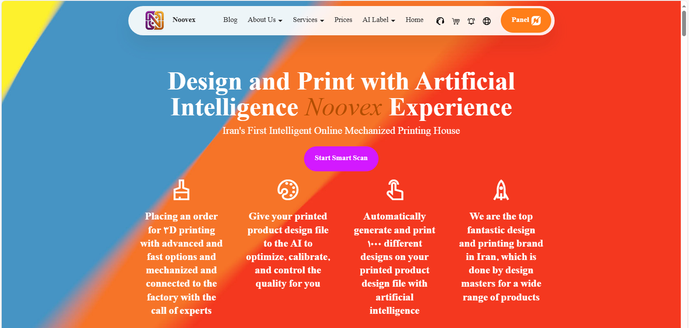
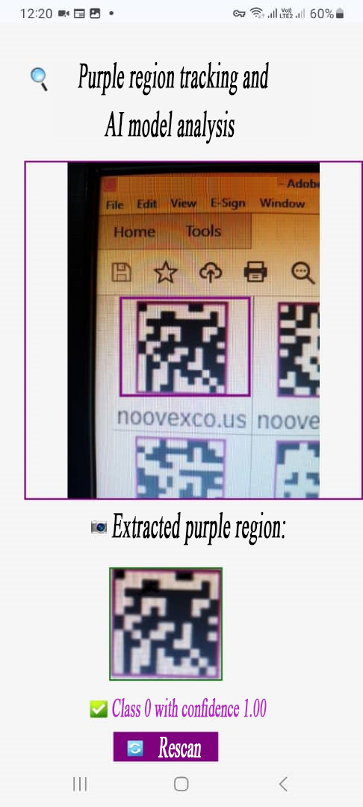

# 🧠 AI-Powered Label Authentication & Smart Printing Platform

A cutting-edge AI system for generating and verifying intelligent product labels—scannable exclusively via the company’s platform—to ensure 100% brand authenticity.  
These multi-functional labels go far beyond traceability: enabling product marketing, warranty validation, smart locking, and dynamic product info—all accessible through an advanced B2B dashboard.  
Also includes an AI-driven smart printing website for automated label design, optimization, and mass production in seconds—revolutionizing how manufacturers and businesses order and manage intelligent labels.

---

## 🏢 Company: Novin Vajeh Exir Co. (NOOVEX)

**Novin Vajeh Exir Co.** is Iran’s leading label printing and branding firm, with over 20 years of experience serving major manufacturers.  
This project is part of the company’s transition to a **knowledge-based** enterprise, with full R&D documentation submitted and approved.  
The company specializes in product labeling, branding, and advertising, and now expands into AI-driven automation and authentication.

Project initiated at the CEO’s request, based on my professional background as a researcher in engineering and computer science since 2011, a full-stack developer since 2016, and an AI engineer since 2019.

🔗 [NOOVEX – Official Company Website](https://noovexco.com)  

### 🚀 **NOOVEX Smart Printing Platform**

This repository documents the development of **Iran’s first intelligent online mechanized printing house**, initiated by *Ehsan Lesani* for **NOOVEX**, a company with a long-standing industrial background now evolving toward knowledge-based innovation.

Built on an AI-driven R&D infrastructure, NOOVEX is pioneering the production of **the world’s first multi-purpose AI-powered product labels—enabling** smart authentication, warranty activation, marketing integration, and real-time product interaction. The platform is designed to evolve into a global brand in intelligent labeling and product connectivity.

This platform represents a fusion of industrial automation, artificial intelligence, and user-centric design, positioning NOOVEX as a national leader in intelligent labeling technology.

---

## 📦 Project Modules

### 1. AI-Powered Label Generation

- Unique, tamper-evident labels with hidden AI watermark  
- Deep-learning model trained to detect label authenticity via mobile scan  
- 100% accuracy on 100 real-world test samples  
- GPS-based geo-locking and scan limits for security  
- NFC and blockchain layers planned for future phases  
- Labels act as warranty activators, marketing tools, and product passports

### 2. Smart Printing Platform

- Fully automated label ordering via website/app  
- MIS integration for tracking and scheduling  
- AI-optimized task allocation based on print specs and resources  
- Real-time defect detection via machine vision  
- Auto-selection of product type and label design  
- Future integration with IoT and SCADA for full factory automation

### 3. B2B Dashboard & Analytics

- Product-level dashboards with scan history and engagement metrics  
- Dynamic pricing suggestions via AI based on sales, inflation, and demand  
- Campaign management, user ratings, and loyalty rewards  
- Real-time distribution maps and customer behavior analytics  
- Integration with CRM and marketing tools

### 4. Label Scan Experience

When a label is scanned:

- A unique product page is generated dynamically  
- Includes product info, guides, videos, price history, certifications  
- User can rate, comment, and share the product  
- AI recommends similar products and offers discounts  
- Seasonal campaigns, contests, and loyalty programs are triggered  
- Scan limits and login required for security  
- Future support for biometric verification and environmental sensors

---

## 🧠 Label Generation & AI Recognition Workflow

All product labels are **uniquely generated** and securely stored in the database before deployment.  
Each label is then **learned by the AI model** through supervised training, enabling the system to recognize and verify it with high precision.

Once printed and applied to physical products, these intelligent labels can be scanned by end-users using their mobile devices.  
The platform instantly confirms authenticity and provides relevant product information.

### 🏭 Manufacturer Benefits:
Factories and producers can embed these smart labels into their products to unlock features such as:
- Customer engagement and marketing analytics  
- Online product information and specifications  
- Warranty activation and tracking  
- Expiry date verification  
- Anti-counterfeit protection

### 📱 User Experience:
Consumers benefit from a unified experience where each product becomes:
- **Verifiable** (authentic or fake)  
- **Informative** (access to specs and usage)  
- **Valuable** (warranty, support, and updates)

This system bridges the physical and digital worlds, turning every product into a trusted, interactive asset.

---

## 🧪 AI Model Development

- Deep learning model built with TensorFlow/Keras  
- Trained on labeled image data from real product scans  
- Fine-tuned for mobile camera input and lighting variations  
- API deployed for live scan validation  
- Model hosted and integrated with web-based scanning interface  
- Future phases include reinforcement learning for supply chain optimization

---

## 🖥️ Website & Demo

The NOOVEX website is fully designed and deployed.  
User panels and AI services are under active development.

### 🔹 Demo Screenshot  
This section showcases the real, working version of the AI-powered label authentication and smart printing platform developed by NOOVEX.

> ⚠️ **Note:** The platform is currently available **only in Persian (Farsi)**. English language support is planned for future updates.  
> In the meantime, you can use browser tools like **Google Translate in Chrome** to view the demo in English.  
> If the site is under development or temporarily unavailable, feel free to **contact me directly** for full access to the demo version.

### 🎯 Live Label Recognition by AI Model 
This section demonstrates the real-time performance of our AI model in accurately identifying unique product labels with **100% confidence and precision**.
The image below shows a live scan of one of our intelligent labels.  
The system successfully detects the purple region, classifies it as **Class 1 with confidence 1.00**, and confirms its authenticity using our deep-learning model.

> ✅ Extracted purple region  
> ✅ Class 1 with confidence 1.00  
> 🔁 Rescan option available for user interaction

This live recognition system is fully integrated into the NOOVEX platform and has been tested on real products using mobile devices — model detects authenticity in under 2 seconds. 
It forms the backbone of our label authentication engine and will be expanded with NFC, blockchain, and biometric layers in future phases.

---

## 🚀 Current Status

- ✅ MVP completed and deployed  
- ✅ AI model trained and integrated  
- ✅ Live scan API and web interface operational  
- ✅ Label generation and printing modules functional  
- ⏳ Server provisioning and storage setup pending  
- 📦 Factory automation design documented for future implementation

---

## 🧭 Future Roadmap

- Full IoT/SCADA integration for smart factory  
- NFC-enabled labels with dynamic data layers  
- Blockchain traceability for supply chain transparency  
- Biometric and location-based access control  
- AI-powered label design assistant and recommender system  
- AR/VR preview of labels on product packaging  
- Smart warehouse automation with RFID/QR scanning  
- Environmental condition tracking and alerting

---

## 🎯 Target Markets

- Pharmaceuticals  
- Cosmetics & beauty exports  
- Organic food (e.g. honey, saffron, tea)  
- Electronics & spare parts  
- Fashion & luxury goods  
- Toys & baby products  
- Agricultural inputs (fertilizers, pesticides)  
- Artworks & handicrafts  
- Books, jewelry, and high-value exports  
- Medical equipment  
- Confidential document tracking  
- Concert & exhibition ticketing  
- Supply chain management for FMCG and perishables

---

## 🧩 Tech Stack

- **Frontend**: HTML, CSS, JavaScript, jQuery, Vue.js  
- **Backend**: PHP, Flask (Python)
- **AI Services**: Python, TensorFlow/Keras  
- **Database**: MySQL, Redis  
- **DevOps & Cloud**: Google Colab, Docker, Google AI Cloud
- **IoT/SCADA**: MQTT, OPC UA, Raspberry Pi/PLC  
- **Security**: JWT, GPS lock, biometric layers (planned)

---

## 📄 License & IP

This project is proprietary to **Novin Vajeh Exir Co. (NOOVEX)** and protected under NDA and licensing agreements.  
All AI models, datasets, and platform code are part of the company’s R&D initiative for certification.

## 🛡️ Development & Publishing Rights

This project was independently developed by **Ehsan Lesani**, founder of [BesparWeb](https://www.besparweb.com), as a commissioned solution for **Novin Vajeh Exir Co. (NOOVEX)**.
BesparWeb has been granted limited publishing rights to showcase the technical achievement and platform capabilities for portfolio and demonstration purposes.
All proprietary assets, including AI models, datasets, and platform code, remain under the ownership of NOOVEX and are protected by NDA and licensing agreements.

---

## 🤝 Contact & Collaboration

For commercial collaboration, partnership inquiries, demos, or technical collaboration, please contact:

**Ehsan Lesani**  
AI Solutions Architect | AI Engineer | Full-Stack Dev | Remote-first CTO | AI Lead & R&D Architect  
🔗 [Official Site](https://besparweb.com)  
📂 [Linkedin Profile](https://www.linkedin.com/in/ehsan-lesani-ai)  
📧 [Contact for Commercial Collaboration](mailto:ehsan.lesani.ai@gmail.com?subject=AI%20Project%20Execution%20Request)

---

> 🚧 This repository reflects an active R&D project. Contributions, feedback, and strategic partnerships are welcome.
